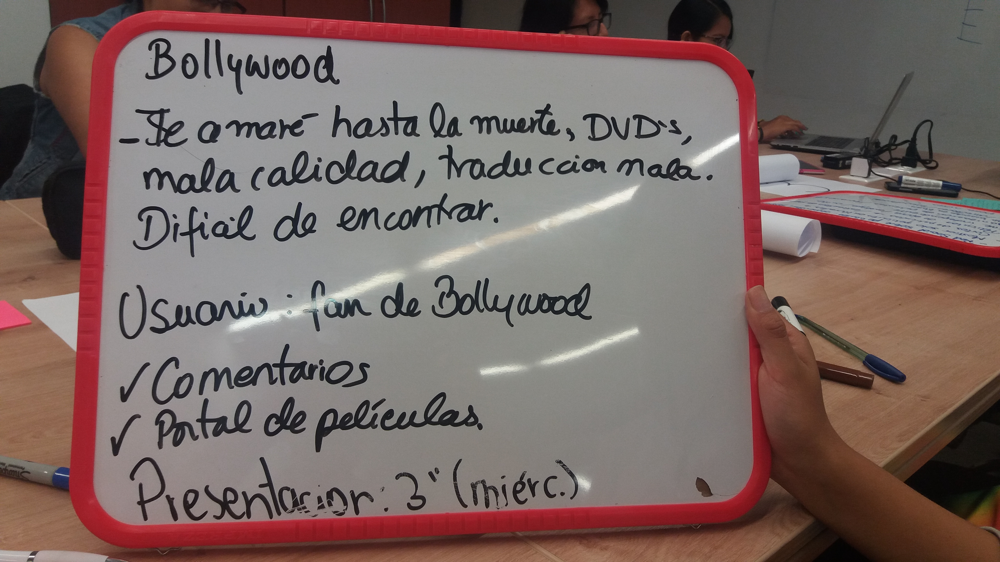
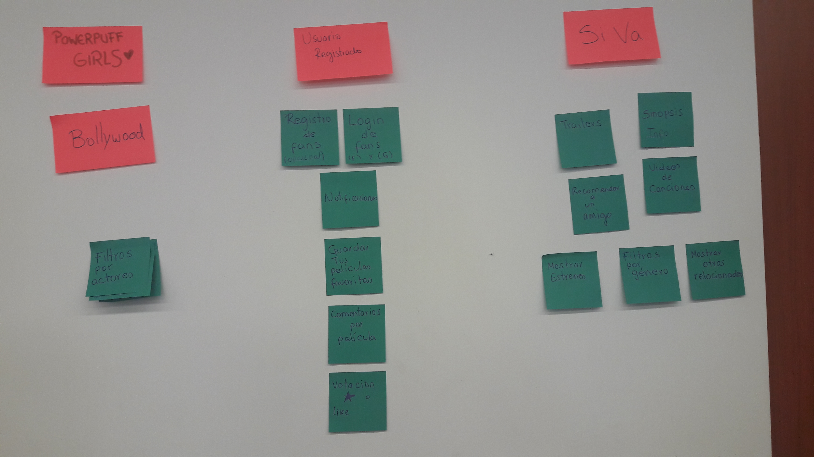
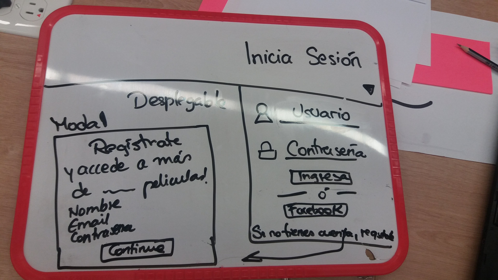
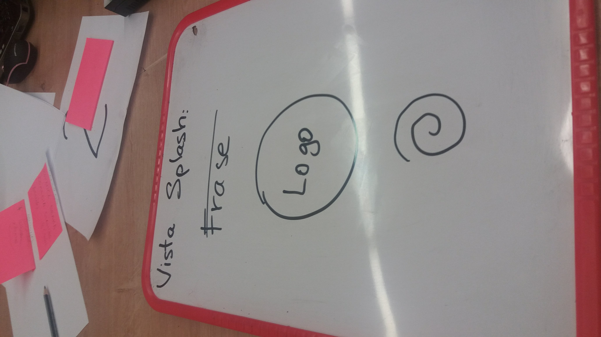
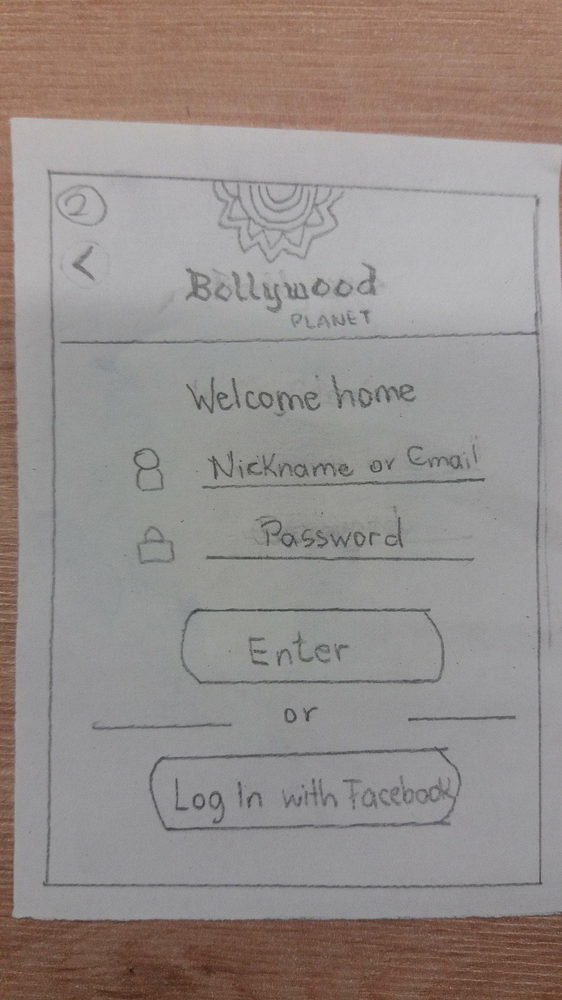
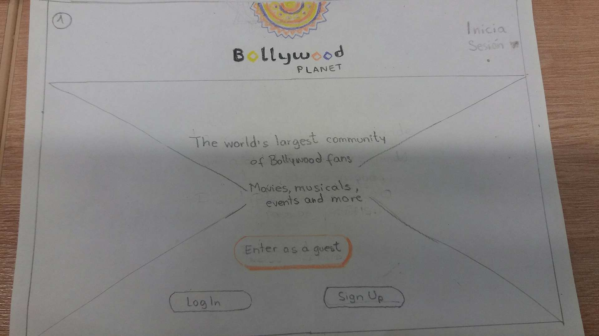

# Reto Hackaton 
---

## Dia 1

## Planificación 
El primer día realizamos Brainstorming para obtener la mayor cantidad de ideas posibles.
* Elegimos al usuario que es fan de las películas de Bollywood.
* Para ello elaboraremos un portal web de películas de Bollywood con versión mobile y desktop, que tenga contenido de calidad sobre las películas y que le brinde la posibilidad de buscar facil y rapidamente las peliculas segun el tipo de gustos que tenga.

## ¿Por qué escogimos el tema de Bollywood ?
Investigando en otras páginas web, descubrimos que hay muy pocos portales específicos sobre este tipo de películas y su público es muy grande. Es díficil buscar una película de Bollywood por Internet sin que se descargue virus y con contenido de calidad, mayormente los usuarios compran las películas en DVD´s y no quedan del todo satisfechos.

## Brainstorming de Ideas del portal
* Durante esta etapa comenzaron a fluir ideas sobre lo que va a contener el producto, y las fuimos pegando aleatoriamente.
* Luego fuimos priorizando que elementos si son  factibles realizar en el tiempo que se nos brindo.
* También nos sirvio para establecer que tenemos dos tipos de usuarios:
  * Fanaticos de Bollywood
  * Usuario que sólo entra por recomendación 

## Sketch

### 1.- Primer boceto 
## Versión desktop :

## Versión mobile :

## Eleccion del nombre del Portal y Diseño del Imagotipo:

Elegimos "Bollywood Planet", por el mismo hecho que nuestro público objetivo son los fanáticos de Bollywood y Planet, porque somos mas que un portal web, somos una comunidad internacional de aficionados a Bollywood y al cine hindú que no solo ofrecemos peliculas de calidad, si no también contenidos extra como los musicales que son muy representativos de Bollywood, noticias, eventos y mucho más. 

## Identidad de Marca:

Queríamos que nuestra marca evoque emoción, entretenimiento, diversión, colores y que tan solo con verlo te evoque la imagen de la India, país donde se producen este tipo de películas, por eso elegimos una tipografía dinámica y el isotipo de Mándala.

Y luego de hacer varios testeos y versiones, finalmente éste fue el elegido.

Repasemos los significados de sus colores :

### Naranja:
El naranja combina la energía del rojo con la felicidad del amarillo.
El color naranja tiene una visibilidad muy alta, por lo que es muy útil para captar atención y subrayar los aspectos más destacables de una página web.
Representa el entusiasmo, la felicidad, la atracción, la creatividad, la determinación, el éxito, el ánimo y el estímulo.

### Amarillo: 
El amarillo simboliza la luz del sol. Representa la alegría, la innovación, la inteligencia y la energía.
Es recomendable utilizar amarillo para provocar sensaciones agradables, alegres. Es muy adeecuado para promocionar productos para los niños y para el ocio.
Por su eficacia para atraer la atención, es muy útil para destacar los aspectos más importantes de una página web.
Ademas esta variacion de amarillo que usamos que es un poco mas oscura, denota tambien prestigio y calidad.

### Púrpura:
El púrpura aporta la estabilidad del azul y la energía del rojo.
Se asocia a la realeza y simboliza poder, nobleza, lujo y ambición. Sugiere riqueza y extravagancia.
El color púrpura también está asociado con la sabiduría, la creatividad, la independencia, la dignidad.
El púrpura representa la magia y el misterio.

### Negro: 
El negro representa el poder, la elegancia, la formalidad, prestigio.
En una página web puede dar imágen de elegancia, y aumenta la sensación de profundidad y perspectiva. 
Combinado con colores vivos y poderosos como el naranja o el rojo, produce un efecto vigoroso.

## Testeo en Usuarios:

Para validar nuestras ideas referentes al diseño del portal y del logo, realizamos preguntas a fanáticos del cine Bollywood (próximos usuarios).

### Preguntas :

#### Usuario 1 : Adrian Elias, 22 años, estudiante.

1. ¿Usarias la plataforma para ver tu siguiente película hindu?

Si, es bonita, simple. Y el plus de ver los musicales y escuchar las canciones me parece genial.

2. ¿La recomendarias?
Si

3. ¿Que sugieres para mejorar tu experiencia en nuestro portal?
Que tenga variedad de géneros, que el tiempo de carga sea corto y no redireccione a otras paginas de publicidad, que se pueda recordar cuentas y que haya opción de ver la película en pantalla completa.

#### Usuario 2 : Juan Llontop, 30, trabajador independiente.

1. ¿Que opinas del logo de la marca (imagotipo)?
Es llamativo, me gustan los colores ya que pienso en algo cálido, me produce una sensacion de felicidad y bienestar, y el morado curiosidad.

2. ¿Que piensas cuando te digo Bollywood Planet?
Que es una marca acerca de todo lo referido a Bollywood.

#### Usuario 3 : Mariela Garcia , 27, ingeniera ambiental

1. ¿Que opinas del logo de la marca (imagotipo)?
Me gusta la combinacion, tiene iluminacion y el mandala es lindo.

## Sketch Version 2: 

### Versión Mobile:

### Versión Desktop:

# Organizacion
## dia uno: 
* Claudia: Investigación sobre Bollywood y colores de Hindu
* Carla: Investigacion sobre API 
* Yolanda: Avances del flujo de ventanas
* Yasmin:Testeo a cierto grupo de personas para filtrar información.
## dia dos:
* Claudia: Diseño de las ventanas con los colores con sus significados
* Carla: Avances sobre jalar informacion de la api
* Yolanda:Maquetado de las ventanas
* Yasmin: Data JSON.
## dia tres:
* Claudia:Diseño del logo
* Carla:funcionabilidad
* Yolanda:arreglos de maqueteo y avances del readme
* Yasmin: maquetado de vistas y funcionalidad de posteo.

## Realizado por Squad Powerpuff - Girls.
## Miembros : 
* Centeno Ramos, Carla
* Mattos Conislla,Yasmin
* Zarate Cordova,Claudia
* Ventura Chavez, Yolanda.

